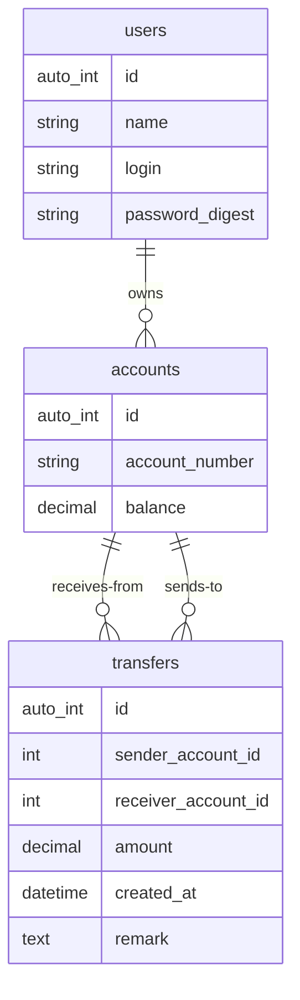

# Digidentity Assessment

Below are my notes and comments as I went through the process of completing this assessment.

## Assignment
> The Ruby Bank
> 1. Build a simple rails banking app.
> 2. Via the console you can create users with password.
> 3. The user must be able to log in.
> 4. Via the console you can give the user credit.
> 5. User has a bank account with balance.
> 6. Users can transfer money to each other.
> 7. Users may not have a negative balance on their account.
> 8. It must be traceable how a user obtained a certain balance.
> 9. It is important that money cannot just disappear or appear into account.
>
> Expectations
> • The project is structured in a logical way that allows future extensions in
> terms of functionality and maintainability.
> • Our Quality Assurance engineer should be able to understand the build-up
> of your application and know what and how you have tested already.

## First thoughts
* Correctness:
  * ensure transaction isolation (with database transactions)
  * ensure atomicity and seriality (with pessimistic locking)
  * ensure auditability (by storing all transfers in order)

* Security:
  * account ownership validation
  * credentials encryption at the db level
  * client communication encryption (TLS) (not implemented due to time constraints)

* Performance
  * minimal locking (avoid table locks)
  * only calculate balance at write, not at read

## Assumptions

* all amounts in Euro
* minimum precision 0,01€
* maximum allowed balance 1E12€ (not enforced)
* Currency unit not stored
* A user can only transfer money out of their account to another account

## Database
Requirements:
* relational
* supports transactions, row locking
* well supported by Ruby on Rails

Choice: PostgreSQL

### ER Diagram

Rationale:
* store users separately from accounts, for reasons of separation of concerns, and for extensibility (multiple accounts per user, multiple users per account etc)
* store transfers for auditability
* store balance with account for performance

## Architecture

* Simple bog standard Ruby on Rails MVC layout
* Ruby crypto stdlib for password encryption
* Standard Rails session management
* Models validate their own data, enforce uniqueness at the database level
* Business logic in service objects
* Thin controllers that delegate to service objects
* Good separation between views and models, avoid direct coupling where possible

## User interface

### Views
* login form
* balance and transfer history view
* transfer form

Due to lack of time the interface is as bare and basic as it can be, no time spent on layout and css.

## Algorithms

### Money transfer
```
begin database transaction
  lock both accounts for update with one single SQL query (to avoid potential deadlocks)

  validate receiver and sender account
  validate amount to transfer

  insert new transfer record
  update sender account balance
  update receiver account balance
  audit balances by calculating balance from transfers and comparing
commit

rescue any exceptions
  handle errors
```

Initial seeding, cash deposit and withdrawal are emulated by transferring to or from the bank's system account '00000000'.

### Balance calculation
```
sum all amounts from transfers containing account as receiver
subtract from this result the sum of all transfers containing account as sender
```

## Tools/snippets (console)

* Add user (+ account). Make sure to have the account balance set to 0 or the user will not be able to make any transfers.
  ```
  user = User.create(name: 'John Doe', login: 'john@doe.net', password: 'secret 123', password_confirmation: 'secret 123')
  user.accounts.create(account_number: '12344321', balance: 0)
  ```
* deposit cash into account (actually transfer funds from the bank's system account)
  ```
  Funds.create_transfer(Account.find_by_account_number('00000000'), Account.find_by_account_number('12344321'), 100000, 'cash deposit')
  ```
* withdrawal from account (actually transfer funds to the bank's system account)
  ```
  Funds.create_transfer(Account.find_by_account_number('12344321'), Account.find_by_account_number('00000000'), 1000, 'cash withdrawal')
  ```
* transfer between accounts
  same as withdrawal above but with another receiver account number as second argument.

## Tests

Ideally, full automated test coverage is best, however due to lack of time the application has been mostly tested manually.

#### Manual tests Sunny day - Golden path
* A user must be able to login with the correct credentials
* When a user has one account, show the account page
* When a user has multiple accounts, show an account list page
* A user must be able to transfer money to another account
* When a transfer is executed, the account balance is adjusted accordingly on both accounts
* The transfer list history must always match the account balance (except for the initial seed of the bank's system account '00000000')

### Manual tests Validations and authentication
* A user must not be able to login with wrong or missing credentials
* A user must only see their own account(s)
* A user must be redirected to their own account if they try to load somebody else's account
* A user must not be able to transfer more than the account balance
* A user must not be able to transfer money to a non-existent account
* A user must not be able to transfer a negative of zero amount
* A user must not be able to transfer money to the same account
* When a user is logged out, they cannot visit their account or execute transfers without logging in
* When a transfer is executed, the account balance is adjusted accordingly on both accounts
* The transfer list history must always match the account balance (except for the initial seed of the bank's system account '00000000')

### Automated tests for scenarios that are difficult or impossible to test manually
* concurrent transfers should execute serially
* it should not be possible to deadlock transfers
* a transfer should fail when the transfer history does not match the balance [not implemented due to time constraints]
* the correct exceptions should be raised when a transfer fails [not implemented due to time constraints]

## Local install
Prerequisites:
* Ruby 2.7.4 installed via rbenv
* PostgreSQL installed and running, your user account needs enough rights to create databases
* Bundler installed
* Make sure you do not have any existing PostgreSQL database named 'banking_development' or 'banking_test' as these will be overwritten.

```sh
git clone banking
cd banking
bundle
rails db:reset
rails test
```

To start a local server (at http://localhost:3000):
```sh
rails s
```

The database is seeded with a user with login `testuser` and password `testtest`. This user has two accounts, '12345678' and '87654321', you can start with transferring money from one account to the other for example. There is also a bank system account '00000000' to mimic cash deposits and withdrawals.

## Initial project development bootstrap
Rails skeleton app was generated as follows (do not run this now):
```sh
rails new banking --database=postgresql
cd banking
rails db:reset
rails generate model User name:string login:string:uniq password:digest
rails generate model Account account_number:string:uniq 'balance:decimal{15,2}'
rails generate model Transfer sender_account:references:index receiver_account:references:index 'amount:decimal{15,2}' transfer_type:string status:string remark:text
rails generate controller Sessions login logout
rails generate controller Accounts index
rails generate controller Accounts/Transfers
```
Due to time constraints, no efforts were made to remove unused modules like ActionMailer, ActiveJob and so on.
